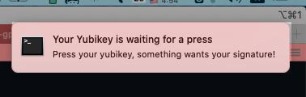

# Yubikey GPG Watcher

If you use you yubikey to sign your git commits using GPG, then you are used to this little blinking green light that's waiting for you to touch it.

And sometimes, well, sometimes, _you forget to click on this button_ and then git gives up and you have to run your command again. That's easy if this is a commit, but if this is a complex script that waiting for CI to run remotely to merge your changes, then it's **very** frustrating to miss this light.

This script runs on your Apple laptop and watch for git asking GPG to sign a commit. When this happens, it will pop a notification. That's all.

I wrote this code out of frustration. I run the same CI script 10 times the same day and missed this signature several times.

## Running the code

```shell
cargo run --release
```



_the notification!_

By default, the notifier watches `git` and `gpg` every `wait_delay` seconds.
Using a larger wait delay will help you click on the key faster than the notification fires.

```
USAGE:
    yubikey-gpg-watcher [FLAGS] [OPTIONS]

FLAGS:
    -d               print debug information verbosely
    -h, --help       Prints help information
    -V, --version    Prints version information

OPTIONS:
    -b <notification_body>           body for the notification [default: Press your yubikey,
                                     something wants your signature!]
    -t <notification_title>          title to use for the notification [default: Your Yubikey is
                                     waiting for a press]
    -w, --wait_delay <wait_delay>    Delay in seconds to wait before firing the notification
                                     [default: 2]
```